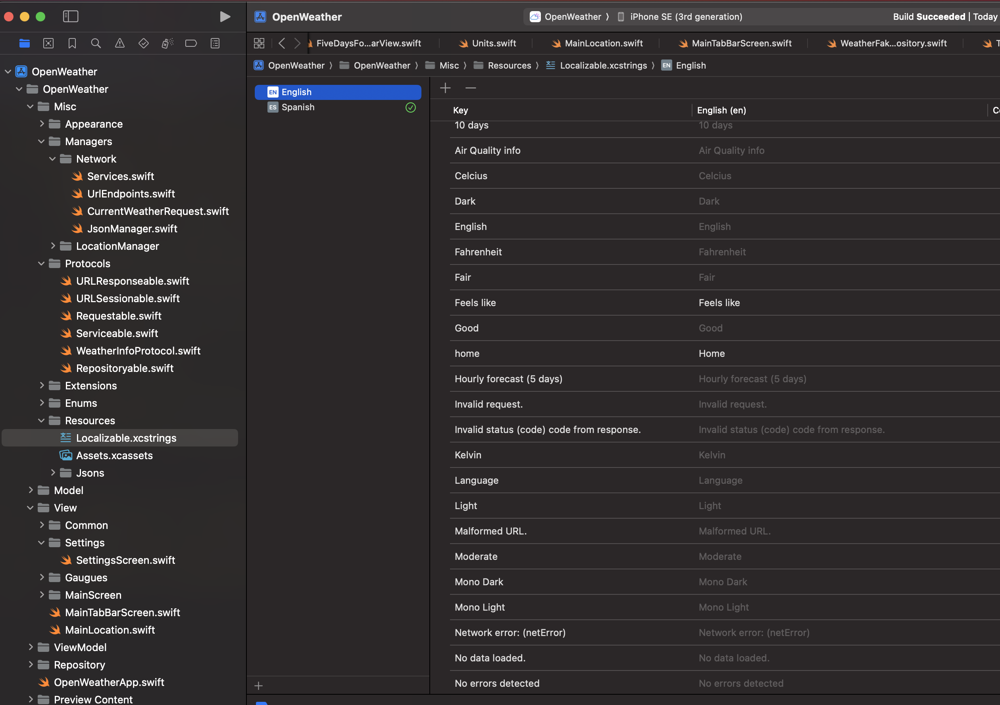
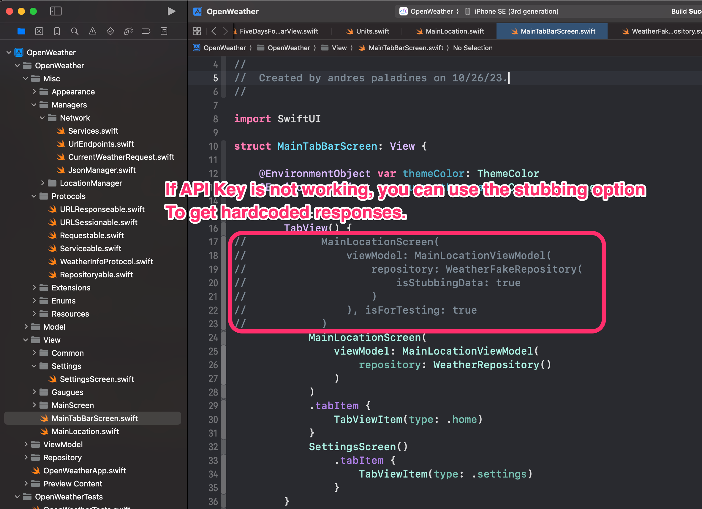
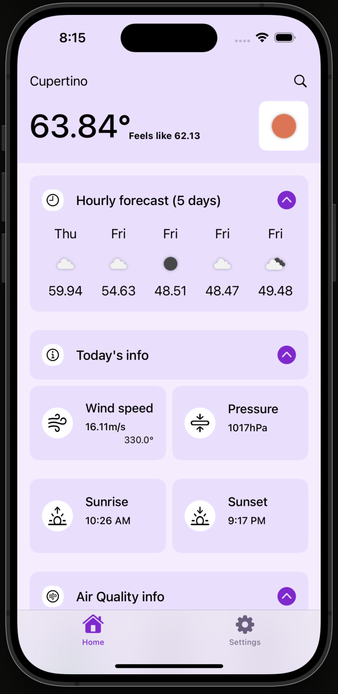
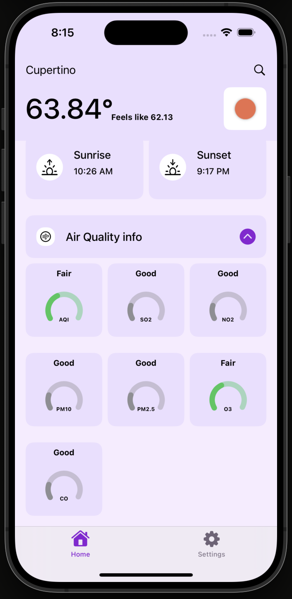
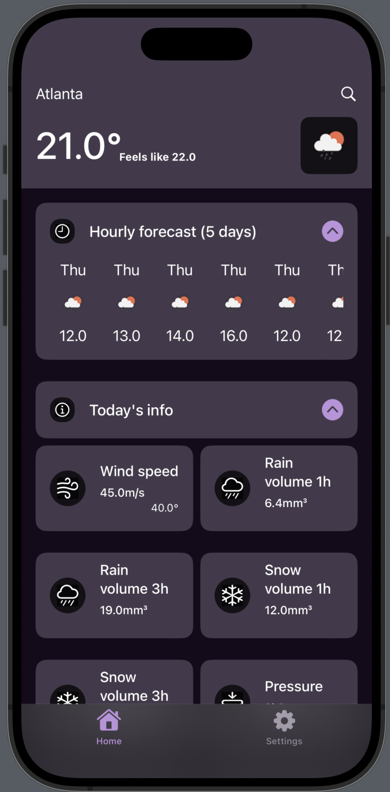
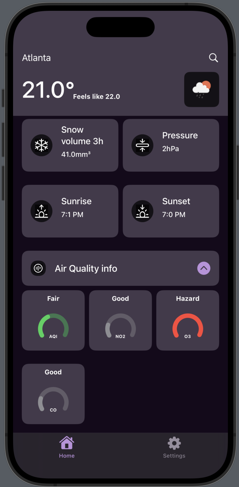
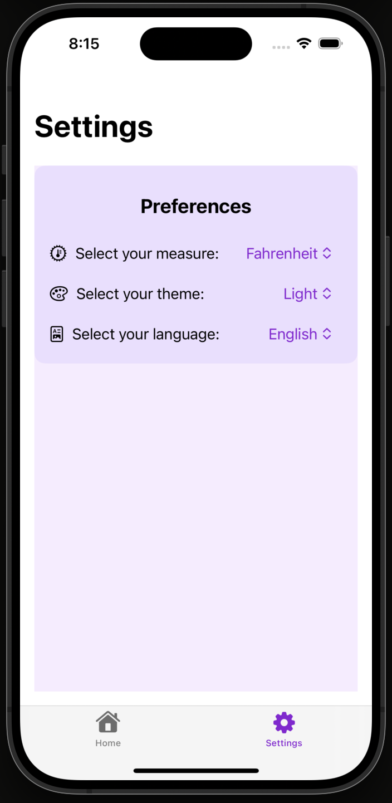
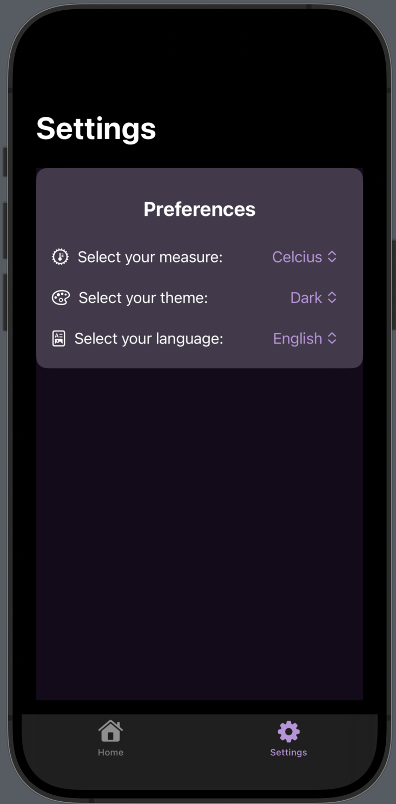

# OpenWeather
## Author: Andres D. Paladines
This app is made in SwiftUI, manages Color themes, Internationalization and measure types.

[![License][license-image]][license-url] [![Swift Version][swift-image]][swift-url] [![SwiftUI][swiftUI-image]][swiftUI-url] 

[swift-image]:https://img.shields.io/badge/Swift-5.8.1-orange?style=for-the-badge
[swift-url]: https://swift.org/

[license-image]: https://img.shields.io/badge/License-MIT-blue?style=for-the-badge
[license-url]: LICENSE

[SwiftUI-image]: https://img.shields.io/badge/SwiftUI-4.0-orange?style=for-the-badge&logo=swift&logoColor=white
[SwiftUI-url]: https://developer.apple.com/xcode/swiftui/

### Todo:
In the structure files contains: 
- [x] Change language [Current Branch](https://github.com/adpaladines/OpenWeather/tree/languages-tabbar-fix):
    - [x] (fix): Bottom tab bar change languaje immediately.
    - [x] Merge with develop branch.
- [ ] Api Key hot swap:
    - [ ] Functionality to change Api Key.
    - [ ] View (modal or new config element) to change Api Key.
    - [ ] Usage of modifiable Api Key in app.
- [ ] Migrations [Current Branch](https://github.com/adpaladines/OpenWeather/tree/migrations):
    - [ ] Closures to Combine in Services.
    - [ ] Closures to Combine in ViewModel and Repository.
- [ ] Api Key change in app tutorial [Current Branch](https://github.com/adpaladines/OpenWeather/tree/in-app-tutorial):
    - [ ] View explaining how create own Api Key.
    - [ ] View explaining how to change Api Key.
  
App manages light and dark themes.

| Capture Description | Screenshot 1 | Screenshot 2 |
|--|--|--|
| Internationalization & Stubbing data (if no API Key) |  |  |
| Home Screen Light |  |  |
| Home Screen Dark |  |  | 
| Settings Screen Light |  |  |
| Settings Screen Dark |  |  |

